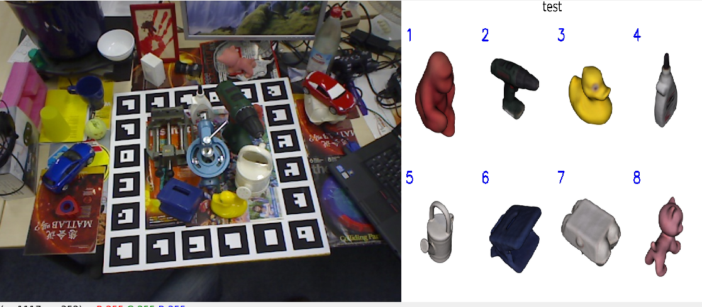

# 6DPoseAnnotator

An interactive 6 degree-of-freedom pose annotation tool using point cloud processings.



## Requirements
- [open3d==0.11.1](http://www.open3d.org/)
- [opencv-python==4.4.0.44](https://opencv.org/)


# TODO:
- [ ] Show object coordinate
- [ ] Add score visualizer
- [ ] Add smart view controller

Try:
```
$ conda activate pose-anno
$ pip install opencv-python==4.1.2.30.
$ python annotator.py
```

