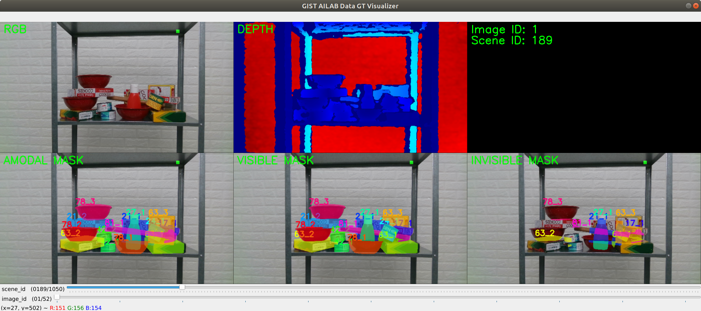

# Pose Anno Tool

Object and Hand pose annotation toolkit for occluded dataset project.

## Object Viewer
```
conda activate pose-anno && cd object-viewer && python object_viewer.py
```


## Object Pose Annotator

```
conda activate pose-anno && cd object-pose-annotator && python object_pose_annotator.py
```


## GT Visualization





```
conda activate pose-anno && cd gt_visualizer && python data_gt_visualizer.py
```

## Hand Pose Annotator


# Authors
- Seunghyeok Back
- Raeyoung Kang
- Joosoon Lee