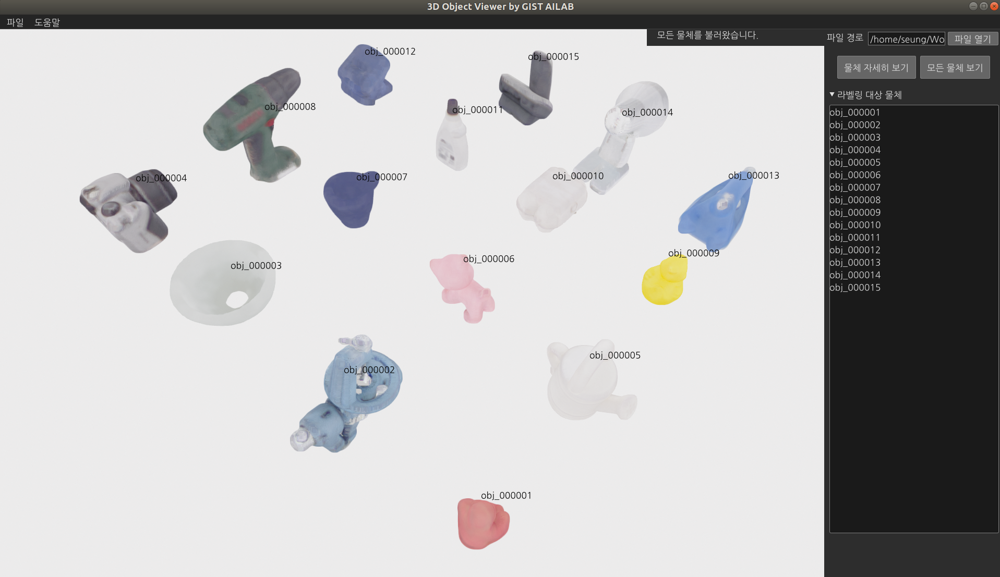

# Pose Anno Tool

Object and Hand pose annotation toolkit for occluded dataset project.

- [ ] Create icon per program
- [ ] Annotation verification program
- [ ] User test
- [ ] Support GIST BOP format

## Object Viewer
```
conda activate pose-anno && cd object-viewer && python object_viewer.py
```


## Object Pose Annotator

```
conda activate pose-anno && cd object-pose-annotator && python object_pose_annotator.py
```


# Authors

- Seunghyeok Back
- Raeyoung Kang