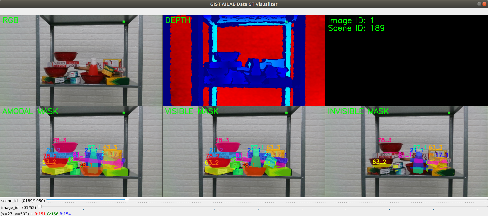
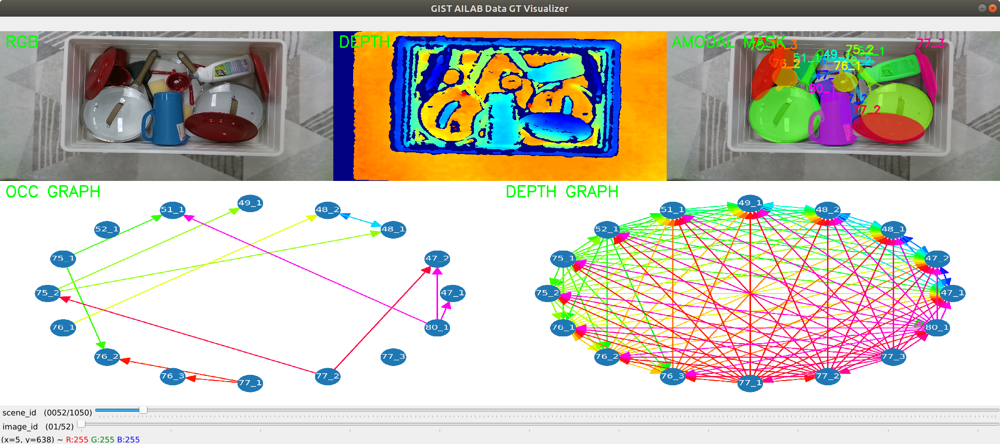

## GT Visualizer





Environment Setup
```
$ conda create -n pose-anno python=3.7
$ conda activate pose-anno
$ pip install -r requirements.txt
$ pip install numpy matplotlib==2.2.5 open3d glumpy pyrender imgviz pyglet
$ pip install opencv-python==4.5.3.56
```

1. data_gt_visualizer
```
conda activate pose-anno && cd gt_visualizer && python data_gt_visualizer.py
```

2. data_order_visualizer
```
conda activate pose-anno && cd gt_visualizer && python data_order_visualizer.py
```