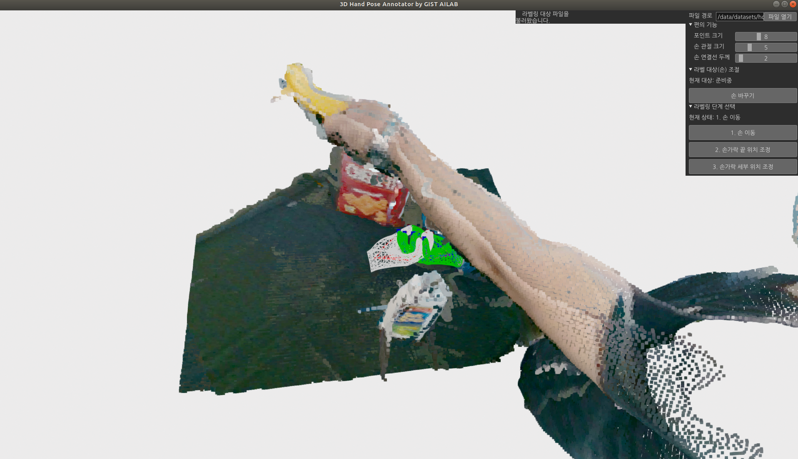

# Hand Pose Annotator




# TODO:
- [X] Select Activate each cam pcd
- [X] Fix redo, undo
- [ ] Mocap pose 
- [ ] Calculate SDF base error
- [ ] Visualize Intersection Area
```
# install requirements
$ conda create -n pose-anno python=3.7
$ conda activate pose-anno
$ pip install numpy open3d==0.15.1 PyYAML opencv-python==4.5.3.56 Cython

# install torch
$ (linux) pip3 install torch --extra-index-url https://download.pytorch.org/whl/cpu
$ (window) pip3 install torch

# install mano
$ pip install git+https://github.com/hassony2/chumpy.git
$ pip install git+https://github.com/hassony2/manopth

# run
$ python hand_pose_annotator.py

# build
$ pip install --upgrade cx_Freeze
$ python setup.py build

```
